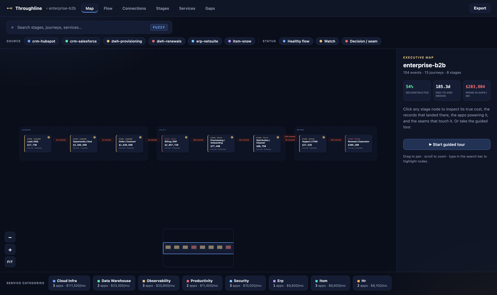

<h1 align="center">Throughline</h1>

<p align="center">
  <em>Reconstruct a business's end-to-end value stream from the data it already produces —
  and see where work stalls, what it runs on, and what it costs.</em>
</p>

<p align="center">
  
  =20">
  
</p>

<p align="center">
  
</p>

---

## The problem

Every business is entities moving through states — a patient through a treatment plan, a deal
through implementation, an order through fulfillment — with time, cost, and labor attached to
each transition. But no single system shows that whole motion. The CRM knows about the deal.
Stripe knows about the invoice. Zendesk knows about the ticket. Each is a keyhole view of one
stretch of the journey, and **the most expensive problems live in the gaps between them** — the
eleven days nobody owns between "sales handoff" and "implementation start," the renewal that
slipped because two systems disagreed about who had the customer.

That operating floor is invisible. A factory has a floor you can walk. A service business has
the same structure — it's just scattered across a dozen exports nobody has ever put together.

## What Throughline does

Throughline ingests an assortment of business data — CSV / JSON / XLSX / text, whatever shape
each source happens to be — and reconstructs the end-to-end value stream as a single
interrogable model:

- **Reconstructs the journeys.** Figures out which records across different sources belong to
  the same journey, even when nothing explicitly links them.
- **Maps the operating floor.** Places every event onto a value-stream stage, then computes
  cycle time, cost per stage, labor load, handoff gaps, and bottlenecks.
- **Captures what the business runs on.** Inventories the applications, services, and vendors
  behind the work — and what they cost — so cost-per-stage is real, not labor-only.
- **Renders it interactively.** A model-first HTML view and a token-gated local dashboard you
  can click through, from value-stream altitude down to the raw source record.
- **Stays honest about what it knows.** Every link carries a confidence score; every gap is a
  first-class object; the headline ledger says plainly how much was reconstructed vs. inferred
  vs. couldn't-be-connected.

## The core idea: the seam nobody owns

A bottleneck is invisible from any single source. It becomes visible only when you line two
sources up and see the interval neither of them accounts for. **That reconciliation is the
product.**

The hard part — and the thing Throughline is built around — is doing it without lying to you.
Naively matching "records that look similar" silently merges two of one customer's separate
orders into one fake journey, and then every number downstream is wrong in a way that still
looks plausible. Throughline treats journey reconstruction as **sequence linkage, not
deduplication**: it walks each chain in stage-and-time order and uses the expected shape of a
journey (one deal has one invoice; one patient has many treatment plans) to know when it has
crossed from one journey into the next. The over-merge guard is a tested invariant, not a hope.

## Two dimensions of the operating floor

| Dimension | What it captures | What it surfaces |
| --- | --- | --- |
| **Value stream** | Journeys of entities through stages, with time / cost / labor per transition | Cycle time, bottlenecks (interval seams nobody owns), handoff gaps |
| **Service architecture** | The apps, services, vendors, and infrastructure the business runs on, and their costs | True cost per stage (labor + tooling + direct), app sprawl, zombie subscriptions, vendor concentration |

The two are bridged: each service declares the stages it powers, so tooling cost flows onto the
stages it actually supports. An app paid for but powering nothing becomes an **orphan-service
gap** — the service-architecture twin of an interval seam nobody owns. Same honesty principle,
different dimension.

## How it works

A multi-stage pipeline turns raw sources into one persisted model, which a separate step
renders. Cheap, mechanical work is done by deterministic scripts; judgment is done by focused
LLM agents.

```
sources ─▶ profile ─▶ normalize ─▶ detect unit ─▶ join candidates ─▶ reconcile
                                                                          │
   render ◀─ review ◀─ diagnose ◀─ map to stages ◀────────────────────────┘
```

- **Deterministic scripts** compute the evidence: source profiling, and a join-candidate
  detector that scores column-value overlap, fuzzy identifiers, temporal adjacency, and value
  correlation.
- **LLM agents** make the judgments scripts can't: which column is really a foreign key, whether
  a fuzzy match makes business sense, whether an eleven-day gap is a genuine seam or just a
  weekend.
- **The model is the artifact.** Every run writes a structured `model.json` — runs are
  stateless, the model is durable. Re-run to refresh, commit it to share, load it to interrogate
  later. The render reads only the model, never the raw data.

## Quick start

```bash
npm install
npm run build

# Run the pipeline on the bundled example data → writes out/model.json + out/index.html
npm run demo

# Open the static interactive view
open out/index.html

# Or launch the token-gated local dashboard (click-through, model-first)
npm run dashboard
#   📊  serving model: out/model.json
#   🔑  Dashboard URL: http://127.0.0.1:4317/?token=<token>
```

Run the pipeline on your own data:

```bash
node skills/reconstruct-value-stream/run-pipeline.mjs \
  --vertical saas-implementation \
  --sources path/to/your/exports \
  --out out
```

## The dashboard

`npm run dashboard` serves the model on `127.0.0.1` behind a token gate — the URL it prints
carries a `?token=` you need to get past the gate, and it never binds a public interface.

Inside is an **interactive graph explorer** — the value stream as a pannable, zoomable map:

- **Map** — stages as connected node cards inside cluster frames, flow edges weighted by journey
  volume, and the bottleneck seams nobody owns glowing between stages. Click a node for its true
  cost, the records that landed there, and the apps powering it — or take the guided tour.
- **Flow · Connections · Stages · Services · Gaps** — the supporting views: the reconciliation
  made visible (Tier-1 vs Tier-2 links by source), true cost per stage (labor + tooling via the
  service bridge), the service-architecture breakdown (zombie apps, sprawl, vendor lock-in), and
  every gap named with *what it is* plus its dollar/time impact.
- Fuzzy search, source/status filters, a minimap, and an INFO / TOUR side panel — with the
  confidence/gap layer surfaced, not hidden.

## Vertical-agnostic by design

The pipeline is common; only a small per-vertical config changes — stage labels, expected stage
order, and the cardinality rules that power the over-merge guard. Ships with configs for SaaS
implementation, a vehicle service bay, a dental practice, enterprise B2B, and a generic
fallback. A dentist's treatment bay and a B2B onboarding flow share primitives and differ only
in configuration.

## Project layout

```
packages/core/                 reconciliation engine, model schema, diagnostics (typed + tested)
packages/dashboard/            static render + token-gated localhost server
skills/
  reconstruct-value-stream/    the pipeline: SKILL.md + deterministic scripts
  value-stream-dashboard/      launch the local dashboard
agents/                        the LLM agents, one Markdown prompt each
verticals/                     per-vertical stage + cardinality configs
examples/                      synthetic multi-source datasets
docs/specs/                    the locked design documents
```

## Status

**v1.2.0.** Both model dimensions, the reconciliation engine with its over-merge guard, the agent
pipeline, and the interactive graph-explorer dashboard are in place. A three-scale pressure test
(small practice → mid-size SMB → enterprise) passes — the reconciler and the service-architecture
view hold across increasing volume and messiness (see [`docs/PRESSURE-TEST.md`](docs/PRESSURE-TEST.md)).
Build, tests, and the demo run clean.

## License

MIT — see [LICENSE](LICENSE).
